# Using the App from the web interface

How to use `lock_in+pid_harmonic_hf` **v2.3.22** (branch `master`) from the browser, panel by panel, and the usual procedures:
scan, see a peak, get an error signal with the lock-in, close a lock and check it. Technical data of each
instrument is in [App.md](App.md); registers in [FPGA.md](FPGA.md).

The interface is the one of `lock_in+pid_harmonic` 2.3.31 (same panels and buttons); only the harmonic
oscillator is different (period of 120 points: **63.6 Hz – 1.04 MHz**, phase in steps of 3°). Read the
[HF notes](#hf-notes) before loading configurations made for `lock_in+pid_harmonic`.

- [Opening the App](#opening-the-app)
- [Layout of the page](#layout-of-the-page)
- [Panels](#panels)
  - [Toolbar](#toolbar) ([Reset zoom: whole period / rising half](#reset-zoom-whole-period--rising-half)) ·
    [Oscilloscope](#oscilloscope) · [Outputs](#outputs) · [Lock-in modules](#lock-in-modules) ·
    [Ramp Controller](#ramp-controller) ([Tabs period and freq](#tabs-period-and-freq), [Lock osc. screen](#lock-osc-screen)) ·
    [PIDs modules](#pids-modules) · [Lock Control](#lock-control) · [Streaming](#streaming) ·
    [Right panels and displays](#right-panels-and-displays) · [Slow scans](#slow-scans)
- [Typing values with units](#typing-values-with-units)
- [HF notes](#hf-notes)
- [Procedures](#procedures)
  1. [Scan and see the response of the system](#1-scan-and-see-the-response-of-the-system)
  2. [Configure the lock-in to get an error signal](#2-configure-the-lock-in-to-get-an-error-signal)
  3. [Close the lock (Trigger Lock / Lock Now)](#3-close-the-lock)
  4. [Check the lock and release it](#4-check-the-lock-and-release-it)
  5. [Locking at a higher frequency (example: 104 kHz)](#5-locking-at-a-higher-frequency-example-104-khz)
- [Saving and loading configurations](#saving-and-loading-configurations)
- [Saving data](#saving-data)
- [Several clients and Restart](#several-clients-and-restart)
- [Known limitations of the interface](#known-limitations-of-the-interface)

The screenshots were taken on RP2 (RedPitaya_OS 2.04-35) with this App: v2.3.21 (the *Ramp Controller* tabs, *Lock
osc. screen* and *Reset zoom*: board test `reportes/lock-in_pid_h_hf/2026-11-13_1520_v2321.md`, Apps root; there the
ramp was internal and in1 shows only the noise of the bench), v2.3.15 (the Oscilloscope, PID A, Lock
Control config and Re-lock / Monitor panels, the 68.7 s range and the two figures of the generator in
[App.md](App.md)), and v2.3.10 / v2.3.11 (the rest, during the tests of `reportes/lock-in_pid_h_hf.md` and
`reportes/lock-in_pid_h_hf_lock_test/`), against a simulated peak made by `dummy_simulator` on a second board, with
the test configuration `test_files/lock_in+pid_harmonic_hf__lock_mode.json`. Some screenshots taller than the
browser window are two screenshots of the same page joined. Screenshots whose name starts with `h_` are of
`lock_in+pid_harmonic` 2.3.10-2.3.17, used for panels that are identical in both Apps (the title says
"Harmonic lock-in+PID" without "HF").

## Opening the App

Install the App (see the [README](../README.md#installation)) and open
`http://rp-XXXXXX.local/lock_in+pid_harmonic_hf/` (or choose "Harmonic Lock-in+PID HF" in the main menu of the
Red Pitaya). The page starts the App (loads the FPGA and the C controller) and restores the last settings used in this browser (any tab) when **Load last config on init** is checked
(default, Config dialog, since v2.3.17); unchecked, the App starts with its default parameters (see [Saving and loading
configurations](#saving-and-loading-configurations)). If the App is already running (e.g. another tab), the page shows its current state. Use a single tab per board (see [Several clients and Restart](#several-clients-and-restart)).

## Layout of the page

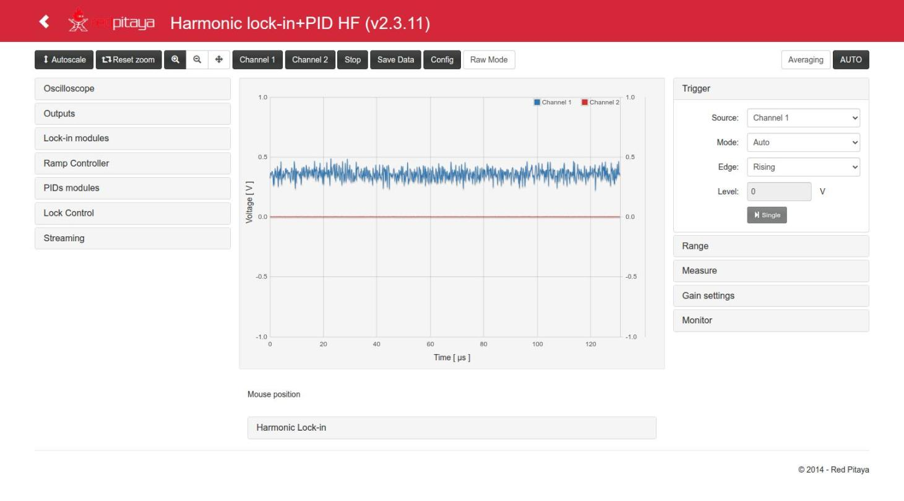

- **Top toolbar**: zoom and acquisition buttons.
- **Left column**: the instruments (Oscilloscope, Outputs, Lock Control, Lock-in modules, Ramp Controller, PIDs
  modules, Streaming; Lock Control is below Outputs since v2.3.17). Each title opens or closes its panel.
- **Centre**: the plot (two Y axes, Channel 1 blue and Channel 2 red), the mouse position, and the
  *Harmonic Lock-in* display (X, Y, R, φ, F1, F2, F3).
- **Right column**: the original scope controls (Trigger, Range, Measure, Gain settings) and the Monitor.

Every change is sent to the board when the field loses focus or Enter is pressed (Escape cancels the edit).
Only changed values are sent. A field left empty (e.g. after Backspace) or with an invalid text is **not** sent:
the last value comes back.

Careful with the **mouse wheel over the plot**: it zooms (both axes, or only time with SHIFT, see the
[Toolbar](#toolbar)), and a change of the time window changes the decimation of the scope (a `POST /data`). Over a
focused number field the wheel changes the value by one step.

## Panels

### Toolbar

| Button | Action |
|---|---|
| Autoscale | Rescales the **Y axis** to the data on screen, only in the page. Does not end a lock capture. |
| Reset zoom, zoom in/out, pan | Plot navigation. A zoom selects the time window of the acquisition (the decimation is chosen from it). Reset zoom (v2.3.14) sets the window from t = 0 to one period of the ramp (Ext Trig = Scan floor / Scan ceil; with Scan floor and a triangle, a second click gives the rising half, [below](#reset-zoom-whole-period--rising-half); with *Lock osc. screen* on, its window), one period of the HF modulation (Ext Trig = harmonic mod., 120·(hp+1) ticks) or one whole memory at the current decimation (otherwise), and Y to −1 … 1 V (raw mode −8192 … 8192). Periods of 1.5 s or more: 0.98 × the period, so that every scan is acquired ([Slow scans](#slow-scans)). During a lock capture it first ends it, as AUTO, and uses the restored Ext Trig. The Raw Mode button rescales Y the same way. |
| Mouse wheel on the plot (v2.3.14) | Zoom centred on the mouse, 1.5× per step. **No key:** both axes (time and the two Y axes). **SHIFT** held: time axis only (the cursor becomes a horizontal double arrow ↔). **ALT** held: Y axes only (vertical double arrow ↕; in raw mode the Y range is in counts). The time window is sent to the controller once the wheel stops (250 ms), which chooses the decimation as for any zoom; it stays between 20 ns and 68.7 s. The Y zoom is only in the page (1/2048 … 1000 × full scale). During a lock capture the wheel zoom is only in the page; ending the capture restores the window saved before it. The wheel on the number fields is not affected (SHIFT ×10, CTRL ×100). With *Lock osc. screen* on (v2.3.21) the wheel without keys zooms Y only and the time zoom (SHIFT, box, X±) changes the ramp limits instead ([Lock osc. screen](#lock-osc-screen)). |
| Channel 1 / Channel 2 | Show or hide each channel. |
| Stop | Stops the acquisition. |
| Save Data | Plot data as Python/Numpy, Matlab/Octave or CSV ([Saving data](#saving-data)). |
| Config | Save / load configurations ([below](#saving-and-loading-configurations)). |
| Raw Mode | Values in counts (`int`) instead of volts. Also the *Level* of the scope trigger (field, slider and line; −8192 … 8191, unit `counts`): switching Raw Mode converts it (counts = V × 8192 / full scale) and sets Y to −8192 … 8192 / −1 … 1 V. Before v2.3.19 the level in Raw Mode was taken as volts by the controller (Normal / Single did not trigger). |
| Averaging | Average inside the decimation. |
| **AUTO** | Auto-set of the scope in the controller (time range, trigger, Y range). Ends a lock capture. Not the same as *Autoscale*. The trigger level is set to the middle of the signal (since v2.3.20 also with a calibration offset of the input; whole counts in Raw Mode). |

#### Reset zoom: whole period / rising half

Since v2.3.21 (port of `lock_in+pid_harmonic` 2.3.31, from `lock_in+pid_plus` 2.2.0), with *Source* = External,
*Ext Trig* = **Scan floor** and a **triangle** ramp (and *Lock osc. screen* off), **each click of Reset zoom
alternates** between the whole period and the rising half (`resetZoomCycleNext()`, `index.html` l. 3494, used by
`resetZoom()`, l. 6450):

1. first click: 0 … T (one whole period, as before; 0 … 0.98 T for T ≥ 1.5 s, see [Slow scans](#slow-scans));
2. next click: **0 … T/2**, the rise from the scan floor to the top (a triangle always rises after the floor,
   [App.md](App.md#ramp-generator-scan));
3. next click: whole period again, and so on, while the zoom is not touched.

Anything else in between starts the cycle again, so the next click gives the whole period: a zoom by hand (box, wheel
with or without SHIFT / ALT, pan, X± / Y±, Autoscale, the scope presets), a change of the trigger (*Source*, *Mode*,
*Ext Trig*, *Edge*) or of the ramp (any tab, the checkboxes, the zoom of *Lock osc. screen*, another client, a config
load: the parameters are compared too), or a window on the plot different from the one of the last click.

With *Scan ceil* (its first half after the trigger is the fall), a **sawtooth**, *harmonic mod.* or another *Ext
Trig* or *Source*, Reset zoom gives one period / one memory on every click, as before; with *Lock osc. screen* on, it
gives the window of Lock osc. screen. With **harmonic mod.** the window is one period of the HF modulation,
120·(hp+1) cycles of 8 ns (`modPeriodCycles()`, l. 3429; `PERIOD_LEN` = 120, l. 154), never a half.

Measured on the board (v2.3.21, ±4000 at 100 Hz, triangle): the clicks gave 0 … 9.984 / 4.992 / 9.984 / 4.992 ms; after
a wheel zoom the next click gave 9.984 ms again and the following one 4.992 ms; sawtooth: 9.985 ms 3 times out of 3;
Scan ceil: 9.984 ms 3 times out of 3, without alternating; *harmonic mod.*: 0 … 0.96 µs with hp 0 (1.042 MHz) and
0 … 20.16 µs with hp 20 (49.6 kHz), the same on both clicks.

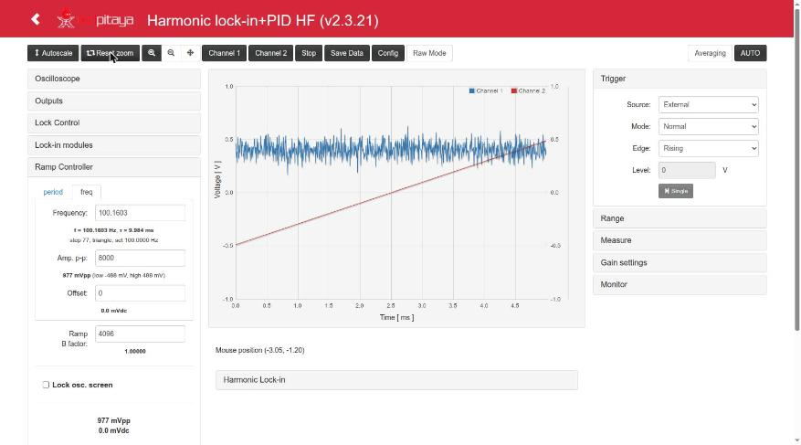

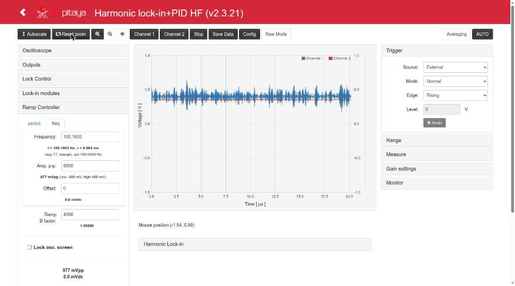

When a click changes the time units (e.g. from a window in seconds to ms) the server repeats the new window in every
`GET /data` until the next POST; since v2.3.21 the page applies that once and never over a window that it has just
set itself ([Structure.md](Structure.md#time-window-of-the-plot-and-force-x)). Board test: 10/10 second clicks from
an axis in seconds (waits of 0 to 12 s) stayed at 0 … 4.992 ms, also 3 s and 6 s later.

### Oscilloscope

- **OscA / OscB**: signal shown on Channel 1 / Channel 2 (any of 25 internal signals:
  in1, in2, error, ctrl_A, ctrl_B, Ramp A/B, PID inputs/outputs, references, Xo, Yo, F1o..F3o, signal_i,
  out1, out2). The fast inputs are seen with `in1`/`in2`.
- **Ext Trig**: event used when the scope trigger *Source* is *External*: None, Pin (DIO0_P), Scan floor,
  Scan ceil, harmonic mod. (start of each modulation period), Out of lock, Jump trigger, Lock control trig
  (the lock event; used by Capture Lock). *Square mod.* is not implemented (always 0 in the FPGA) and is not in the
  menu since v2.3.14.
  Since v2.3.15, picking an Ext Trig other than the current one and not *None* also sets the *Trigger* panel to
  *Source* = External and *Mode* = Normal (one POST). *None* changes nothing else; *Config load*, the end of a
  Capture Lock, *Reset zoom* and *AUTO* keep their own trigger settings.
- **Presets** (v2.3.15): small buttons below Ext Trig that set OscA|OscB in one click: `in1|in2`, `in1|ctrl`
  (in1, ctrl_A), `X|Y` (Xo, Yo) in blue; `in1|err` (in1, error), `ctrl|err` (ctrl_A, error) and `usr` in green.
  They change only the two signals: not the zoom, not the trigger, not a lock capture. `usr` is a pair of your
  own: **double click** on it (or a click while it is not configured; dashed border) opens a dialog with the two
  signals (any signal of the selects); *Accept* saves it in the browser and shows it. The pair is also saved in the
  configs (*Config*: save and download; older configs without it keep the current one). The tooltip of each button
  names its two signals.
- **More options**: *R|Phase Mode* (disabled in this version) and *Disable anti-aliasing filter* for each
  channel.

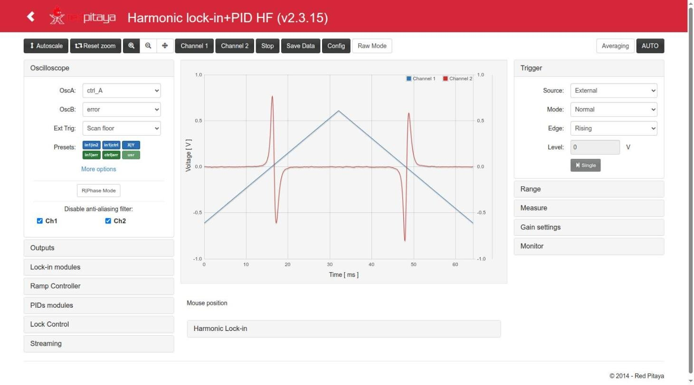

In the screenshot (`lock_mode`, no lock): OscA = ctrl_A, OscB = error, Ext Trig = Scan floor, Trigger External /
Normal, after *Reset zoom* (0 … 64.16 ms): the triangle of the ramp (±0.61 V) and the error with its zero crossings
at ≈ 16.6 ms and ≈ 48 ms (one per peak, on the way up and on the way down).

The time range goes up to 68.7 s (decimation 524288):

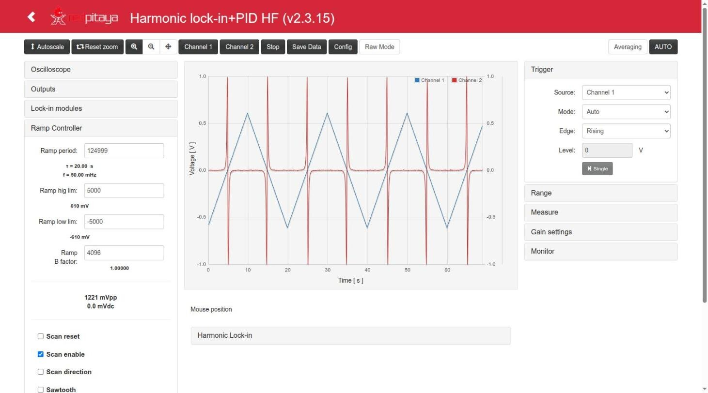

In the screenshot: *Ramp period* 124999 (τ = 20.00 s, f = 50.00 mHz), Ext Trig = None, Trigger Channel 1 / Auto,
window 0 … 68.72 s: the trace is complete from 0.067 s to 68.65 s (1024 points), 3½ triangles with the zero
crossings of the error. With such a slow scan the peaks of the error are larger (the low-pass filter of the
lock-in attenuates them less) and reach the ±1 V of the Y axis. See also [Slow scans](#slow-scans).

### Outputs

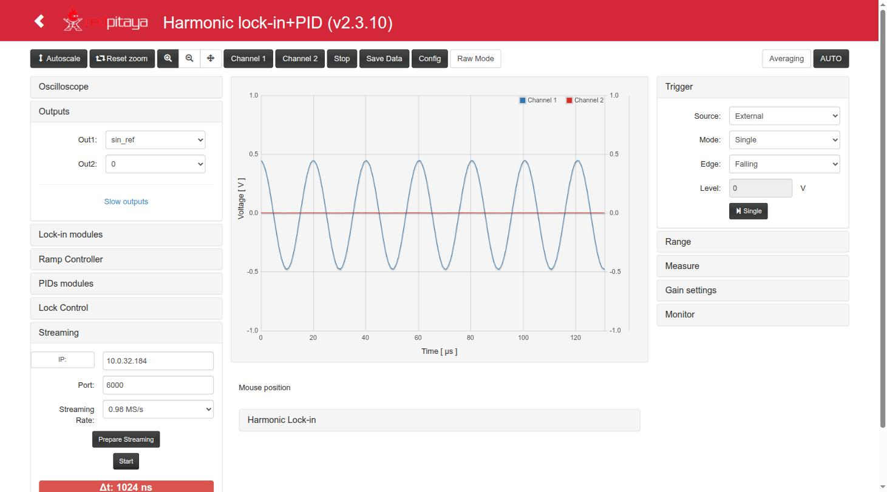

- **Out1 / Out2**: signal sent to each fast output (±1 V): 0, in1, in2, in1−in2, error, cos_1f, cos_2f,
  cos_3f, cos_ref, sin_ref, PID A out, PID B out, ctrl_A, ctrl_B, aux_A, aux_B. For a lock, Out1 = ctrl_A
  (ramp + PID A) is the usual choice.
- **Slow outputs**: four selectors. **They have no effect in this version** (the slow outputs are not
  driven by the FPGA, see [App.md](App.md#inputs-and-outputs)).
- The modulation of *A Out1* / *A Out2* (Lock-in modules → Auxiliar) is added to the output **even when Out1 /
  Out2 = 0**: to leave an output really at 0 V set also its modulation amplitude to −1.

### Lock-in modules

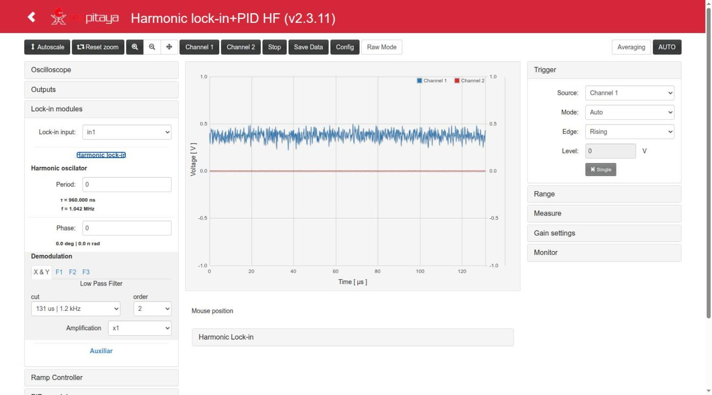

- **Lock-in input**: signal to demodulate (in1, in2, in1−in2, cos_ref, sin_ref, cos_1f, aux_A, Ramp A).
- **Harmonic oscillator**: *Period* (`gen_mod_hp`, 0..16383; shows τ and f below: **0 → τ = 960 ns, f = 1.042 MHz**;
  20 → 49.603 kHz; 16383 → 63.58 Hz) and *Phase* of the F1/F2/F3 references (**0..119 = 0..357°, 3° per step**;
  shown in degrees and π rad below).
- **Demodulation**: tabs *X & Y*, *F1*, *F2*, *F3*, each with its low-pass filter (*cut* = τ | f, *order*
  OFF/1/2) and *Amplification* ($\times 2^{n}$). The filters are the same as in `lock_in+pid_harmonic` (131 µs | 1.2 kHz ..
  4.29 s | 37 mHz).
- **Auxiliar**: *Aux A*, *Aux B* constants, and **Modulation Amplitude** *A Out1* / *A Out2*: amplitude of
  the reference added to OUT1 (`cos_ref`) / OUT2 (`sin_ref`); −1 = off, 0..8191 (≈ value/16384 V).

Frequency vs. *Period* (f = 125 MHz / (120·(Period + 1))): 0 → 1.042 MHz, 1 → 520.8 kHz, 2 → 347.2 kHz,
4 → 208.3 kHz, 9 → 104.2 kHz, 20 → 49.6 kHz, 119 → 8.68 kHz, 1041 → 1.00 kHz. The step between available
frequencies is large near the top.

### Ramp Controller

Since **v2.3.21** (the Ramp Controller of `lock_in+pid_plus` 2.2.0, ported through `lock_in+pid_harmonic` 2.3.31, web
page only) the panel has two tabs, *period* and *freq*, and a *Lock osc. screen* option. The ramp of the FPGA
(`gen_ramp.v`, the same file as in `_h` and pid_plus, md5 `794ad115…`) and its registers are the same as before
(CHANGELOG v2.3.21). The relation between the registers and the physical ramp (period, frequency, amplitude, offset)
is in [App.md](App.md#ramp-generator-scan).

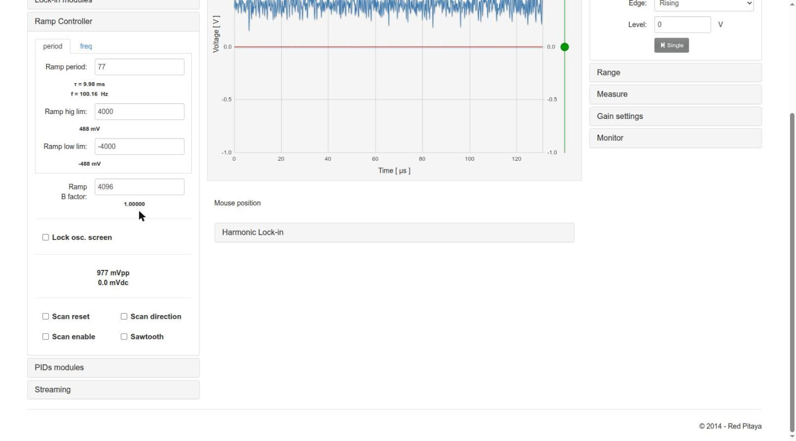

Layout of the panel (top to bottom, `index.html` l. 8713-8909):

- the tabs **period | freq**; the fields of the active tab are inside a box closed by the grey line of the tabs
  (1 px `#dddddd`, CSS `.ramp-tab-pane`, l. 37-46), so it is clear which controls belong to the tab;
- **Ramp B factor** (4096 = 1: ratio of Ramp B to Ramp A; outside the tabs, as before);
- **Lock osc. screen** (checkbox, between two separators, with a short status text below);
- the amplitude (mVpp) and centre (mVdc) of the ramp;
- the four checkboxes in **two columns**: *Scan reset* / *Scan enable* on the left, *Scan direction* / *Sawtooth* on
  the right. *Scan reset* holds the ramp at 0; *Scan enable* runs it (the *Scan enable* button of Lock Control must
  also be on); *Scan direction* is the direction of the sawtooth (a triangle always rises after the scan floor, see
  [App.md](App.md#ramp-generator-scan)); *Sawtooth* unchecked = triangle.

Labels in mV that round to zero show "0 mV", never "-0 mV" (`toFixedNz()`, l. 2113; also Vtrg of the
lock trigger). Board test v2.3.21: with −2 counts in low, hig and Vtrg the labels read "0 mV", and the *freq* tab
"(low −488 mV, high 0 mV)".

#### Tabs period and freq

Only the active tab is visible, so there is only one way of editing the ramp at a time. Clicking the other tab
first applies the edit in progress (as leaving the field) and then **loads the fields of the new tab from the
parameters of the board** (including changes made by another client or a config load); `rampTabSet()`,
`index.html` l. 3781. The last tab used is kept in the browser (`localStorage`, key
`lockin_ramp_tab_lock_in+pid_harmonic_hf`, `ramp_tab_key` l. 3757) and comes back after a reload. The page opens on
*period* when nothing is saved.

**Tab period**:

| Field | Units | What it does |
|---|---|---|
| **Ramp period** | `ramp_step` (clock ticks per step − 1), or **the whole period** with a unit: `s`, `seg`, `ms`, `us` (`10 ms`, `0.5 s`, `10ms`; decimal point or comma) | A number alone is the step. A period is converted to the step whose whole period *T* (below) is the nearest one (`rampStepForPeriod()` / `rampParseStep()`, l. 3554-3575) |
| **Ramp hig lim**, **Ramp low lim** | counts (8192 = 1 V) | Limits of the ramp. Below each field: the limit in mV. They do not accept `mV` / `V` from the page (see [Known limitations](#known-limitations-of-the-interface)); the *freq* tab does |

The period of *Ramp period* is that of the whole ramp, from scan floor to scan floor:

$$
T = N\,(\mathrm{step}+1)\cdot 8\ \mathrm{ns},\qquad N = \begin{cases} 2\,(\mathrm{hig}-\mathrm{low}) & \text{triangle}\\ (\mathrm{hig}-\mathrm{low})+1 & \text{sawtooth} \end{cases}
$$

so it depends on the limits and on the waveform.

- **Enter or leaving the field** sends the value (one POST) and rewrites the field in steps (`77`, `3905`…). While
  typing nothing is sent; the text below already shows the τ / f of what is typed (a preview). Escape restores the
  previous value.
- A text that is not valid (`10 kg`, `abc`, a negative value), or a period with *Ramp hig lim* = *Ramp low lim*, is
  not sent: a red hint appears below ("? steps, or a period with units: s, ms, us" or "? a period needs Ramp hig
  lim &gt; Ramp low lim", l. 2179-2180) and the last value comes back.
- The step is limited to **0 … 2147483520** ($2^{31}-128$, `ramp_step_max`, l. 3532) and rounded as the float32
  parameter of the controller (above $2^{24}$ only every 2nd, 4th … 128th integer exists): `4294967295` or `1e6 s`
  give 2147483520.
- Mouse wheel ±1, SHIFT ×10, CTRL ×100, both ×1000 (above $2^{24}$ the wheel ±1 does not move the step, see
  [Known limitations](#known-limitations-of-the-interface)).
- Below the field: τ (the whole period) and f of the ramp.
- Checking or unchecking *Sawtooth* with the *period* tab active keeps the step, so the period changes (77 with ±4000:
  9.98 ms in triangle, 4.99 ms in sawtooth).
- No tooltip on the label nor the input; a click on the label "Ramp period" opens the help (l. 2041-2045).

Up to v2.3.20 the field was an `<input type="number">`, so a period with units never reached the page, and the old
conversion took (hig − low) steps, half the period of a triangle; the τ of a sawtooth was one step short.

Measured on the board with v2.3.21 (±4000): `10 ms` + Enter → step 77 in triangle, 155 in sawtooth; `4294967295` →
2147483520 (triangle and sawtooth); `10 kg` restores the value; no POST while typing, one with Enter. The periods
measured on the scope trace with the same page code and the same `gen_ramp.v` (`lock_in+pid_plus` 2.2.0-rc2,
`reportes/lock-in_pid_plus/2026-11-13_0747_v220rc2.md`; not measured again with this App):

| Waveform, limits (N) | Typed | Step | T | T measured |
|---|---|---|---|---|
| triangle ±4000 (16000) | `10 ms` | 77 | 9.984 ms | 9.98396 ms |
| triangle ±4000 | `0.5 s` | 3905 | 499.968 ms | 0.49998 s |
| sawtooth ±4000 (8001) | `10 ms` | 155 | 9.9852 ms | 9.98526 ms |
| sawtooth ±4000 | `0.5 s` | 7811 | 500.03 ms | 0.49999 s |
| triangle 1000 / −3000 (8000) | `10 ms` | 155 | 9.984 ms | 9.98399 ms |
| sawtooth 1000 / −3000 (4001) | `10 ms` | 311 | 9.9865 ms | 9.98672 ms |

**Tab freq**:

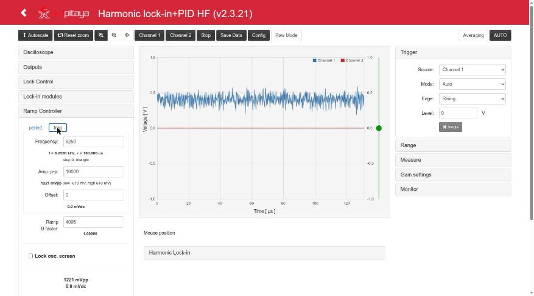

| Field | Units | What it does |
|---|---|---|
| **Frequency** | Hz, or with units: `2.5 kHz`, `10 Hz`, `500 mHz`, `1e3`, `1.5M` (`parseRampFreq()`, l. 3628; `abc`, `-5` are rejected) | Enter (or leaving the field) sets the `ramp_step` whose frequency is the **nearest one** to the value typed, for the current amplitude and waveform (`rampStepForFreq()`, l. 3580). The field then shows the **real** frequency; the text below shows f, τ, the step, the waveform and, if it differs, the value set ("set 100.0000 Hz"). No tooltip. |
| **Amp. p-p** | counts (8192 = 1 V), or `500 mV`, `0.5 V` (`parseRampCounts()`, l. 3619) | Peak-to-peak amplitude = hig − low. Changing it **keeps the frequency** set by the user: the step is recomputed. Text below: mVpp and the two limits in mV. |
| **Offset** | counts, or `mV` / `V` | Centre of the ramp, floor((hig + low)/2). Changing it does not change the frequency. Text below: mVdc. |

- Step, low and high limits go to the board in one POST (`rampSetRegs()`, l. 3855).
- If the amplitude does not fit with the offset (limits −8192 … 8191), the amplitude is reduced (editing the
  Offset, the offset is limited for the amplitude).
- **Mouse wheel on Frequency**: ±1 Hz, SHIFT ±10 Hz, CTRL ±100 Hz, both ±1000 Hz, counted from the **nominal**
  frequency (the one set by the user, not the rounded real one: no drift). Where the integer step can not move
  that little (high frequencies, large amplitudes), or f − 1 Hz would be ≤ 0, the wheel moves the register by
  **one step** in the direction asked (the minimum move of the instrument; it never stays still), and the real
  frequency becomes the new nominal one. At step 0 (the highest frequency for that amplitude) it does not move
  further (`rampFreqWheelTarget()`, l. 3656).
- **Mouse wheel on Amp. p-p / Offset**: ±1, SHIFT ×10, CTRL ×100, both ×1000 counts.
- **Sawtooth** checked or unchecked while the *freq* tab is active (or *Lock osc. screen* is on): the frequency is
  kept and the step is recomputed for the new number of steps (`rampSawtoothKeep()`, l. 3900). With the *period* tab
  active the step is kept, so the frequency changes (triangle → sawtooth roughly doubles it).

Measured on the board (v2.3.21, triangle, report `reportes/lock-in_pid_h_hf/2026-11-13_1520_v2321.md`):

| Input | Registers | Text / real frequency |
|---|---|---|
| (tab opened with the defaults of the App) | step 0, ±5000 | 6250 Hz = $125\ \mathrm{MHz}/(2\cdot 10000\cdot 1)$, Amp. 10000, Offset 0 |
| (a POST of another client: step 300, −1000 / 3000) | step 300, −1000 / 3000 | *period* shows 300 / −1000 / 3000; *freq* 51.9103 Hz, Amp. 4000, Offset 1000 |
| Frequency `100` (Amp. 8000) | step 77, ±4000 | f = 100.1603 Hz, τ = 9.984 ms, "set 100.0000 Hz"; no POST while typing |
| wheel +1 / −1 | 76 / 77 | |
| SHIFT + wheel (±10 Hz) | 70 | |
| CTRL + wheel (±100 Hz) | 36 | |
| SHIFT + CTRL + wheel (±1000 Hz) | 5 | the nearest reachable step; the wheel the other way goes back exactly to 77 |
| `2.5 kHz` | 2 | |
| `500 mHz` | 15624 | |
| Amp. `500 mV` (at 100 Hz) | step 152, ±2048 | nominal 100 Hz kept |
| Offset `0.1 V` | −1229 / 2867 | same f |
| `10 kg` in Frequency | no change | the value comes back, no POST (3 of 3) |

The real frequencies of these steps are those of the formula (and of the board test of `_h` 2.3.31, the same code):
step 76 → 101.4610 Hz, 70 → 110.0352 Hz, 36 → 211.1486 Hz, 5 → 1302.083 Hz, 2 → 2.6042 kHz, 15624 → 500.0000 mHz,
152 with ±2048 → 99.7306 Hz.

The resolution of the frequency depends on the step: $f = 125\ \mathrm{MHz}/(N\,(\mathrm{step}+1))$, so near step 0
the reachable frequencies are far apart (e.g. 2604 → 3906 → 7812 Hz for steps 2, 1, 0 with Amp. 8000).

#### Lock osc. screen

A checkbox below *Ramp B factor* (off by default) that locks the scope screen to the ramp and turns the **time zoom
of the plot into a change of the ramp limits**: zooming on a part of the scan (e.g. around a peak) makes the ramp scan
only that zone, at the same frequency, and the screen shows it over the whole window.

**The window** (`rampLockScreenWindow()`, l. 3950, which uses `resetZoomWindow(.., half)`, l. 3452):

| Waveform | Window | Why |
|---|---|---|
| **Triangle** | **0 … T/2**: the rising half, from the scan floor (t = 0) to the top | in `gen_ramp.v` a triangle always rises after the floor (`floor ? ramp_signal + 1`, l. 157), whatever *Scan direction*: the first half after the trigger is always the rise, so each value of the ramp appears once on the screen |
| **Sawtooth** | **0 … T**: one whole period | the sawtooth goes through each value once per period |
| Sawtooth, T ≥ 1.5 s | 0 … 0.98 T | as *Reset zoom* since v2.3.14, so that the scope is armed again before the next floor ([Slow scans](#slow-scans)). The rising half of a triangle already ends T/2 before the next floor: no 0.98 |

The status text below the checkbox shows the window ("window 0 .. 4.992 ms (rising half: T/2)", "(slow scan: 0.98 T)",
or "(longest memory, the half period is …)" when the window is longer than 68.7 s and is clamped). The axis is set
to that window whenever it differs from it by more than $10^{-4}$ of the window (`ramp_ls_tol`, l. 3761).

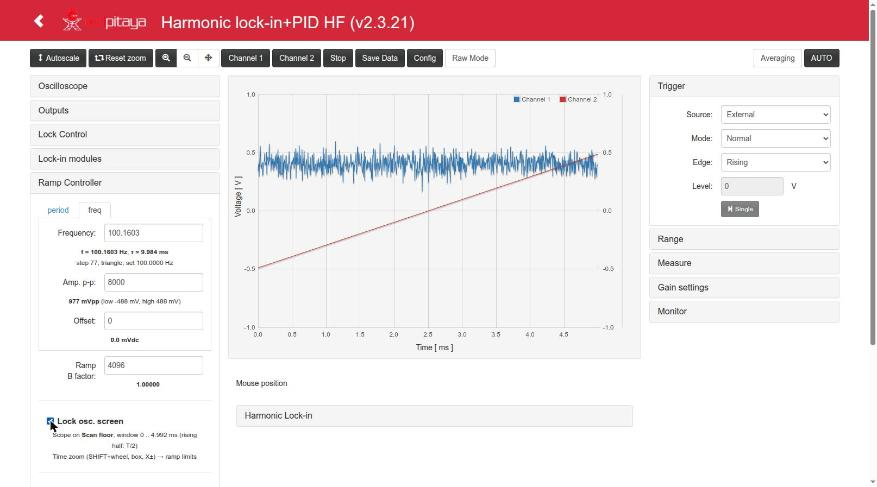

**Turning it on** (`rampLockScreenOn()`, l. 4007):

- the scope trigger becomes *Ext Trig* = **Scan floor**, *Source* = **External**, *Mode* = **Normal** (as when
  choosing an Ext Trig);
- the time window becomes the window of the table above, so t = 0 is the scan floor;
- a *Capture Lock* in progress ends first;
- the text below the checkbox shows the window and "Time zoom (SHIFT+wheel, box, X±) → ramp limits".

**Zoom while it is on** (`rampLockScreenFromX()`, l. 4042, and `rampZoomToLims()`, l. 3717):

| Action on the plot | Effect |
|---|---|
| **SHIFT + wheel**, a **box selection**, the **X− / X+** buttons of *Range* (time zoom) | New `ramp_low_lim` / `ramp_hig_lim`: the values that the ramp has at the two ends of the window zoomed. **Triangle**: the straight line of the rise, $v(t) = \mathrm{low} + \mathrm{amp}\cdot t/(T/2)$, also outside 0 … T/2 (zoom out, pan). **Sawtooth**: the straight line of the sawtooth, extended outside 0 … T. The **frequency of the whole period is kept** (step recomputed with the new N) and the window goes back to the new T/2 (triangle) or T (sawtooth), so the zone chosen fills the screen. |
| The Y part of a box selection | Zooms Y (only in the page), as usual. |
| A box over the **whole width** of the view (within 2 % at each end) | No time zoom: the ramp does not change, only Y is zoomed (`rampZoomIsView()`, l. 3742). |
| **Wheel without keys** | Y only (normally it zooms both axes); **ALT + wheel**: Y only, as before. The registers do not change. |
| **Reset zoom** | Gives the window of Lock osc. screen again. |

The result is limited to −8192 … 8191 with at least 1 count of amplitude.

Measured on the board (v2.3.21, triangle ±4000 at 100 Hz; each row starts from the result of the previous one; the
model is $v(t)$ above; the same numbers as with `_h` 2.3.31 and sq 2.0.10):

| Action | low / hig (model) | f |
|---|---|---|
| Box 1.0024 … 2.5040 ms | −2394 / 13 (−2393.6 / 12.8) | |
| SHIFT + wheel out at 2.5 ms | amplitude ×1.500 | 100.048 Hz |
| SHIFT + wheel in at 1 ms | −2754 / −347 | |
| X+ | | 100.014 Hz |
| X− | | 100.004 Hz |

With `_h` 2.3.31 the box also gave step 259, 99.869 Hz and the window 0 … 5.007 ms, and X+ / X− the limits
−3954 / 853 and −2512 / −589 (`reportes/lock-in_pid_h/2026-11-13_1439_v2331.md`); the report of this App does not list
them.

With a **sawtooth** the window is one whole period (checking *Sawtooth* with the freq tab or Lock osc. screen on keeps
the frequency: 100 Hz ±4000 → step 155, 100.1477 Hz, window 0 … 9.985 ms). With *Scan direction* = 0 the sawtooth
jumps to the high limit after the floor and falls (seen on the board, the same `gen_ramp.v` as always); the time zoom
follows that line.

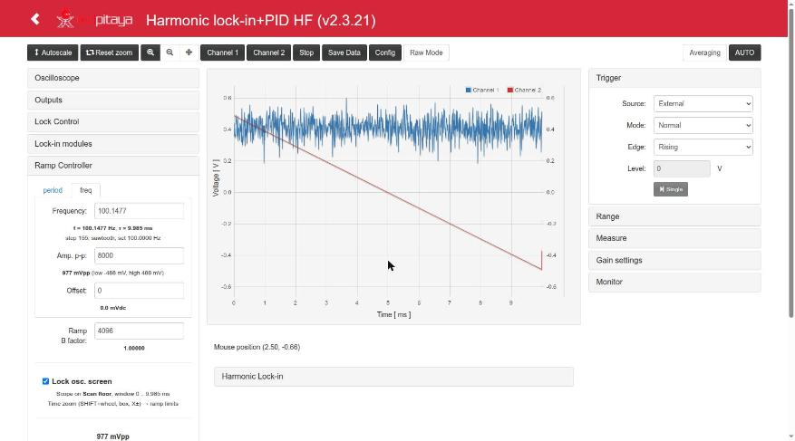

**The window follows the ramp**: any change of step, limits or waveform (either tab, the wheel on the fields,
another client, a config load) sets the window again (only when the ramp changed; `rampLockScreenSync()`, l. 3972).
The trace is cleared only if the window really changes: a zoom that keeps the frequency keeps the acquisition in
progress. Windows longer than 68.7 s are clamped to the longest memory (shown in the text).

**Slow scans / continuous update** (acquisition windows ≥ 1.5 s, the `long_acq` regime of `src/worker.c` in which
the trace is published while it is acquired, see [Slow scans](#slow-scans)):

- armed in Normal on the scan floor, the trace always starts at the floor and **grows to the right**; with a
  triangle it reaches the top at T/2, stays still for the other half period and starts again from the floor;
- the time zoom uses the model of the ramp, not the samples, so it works with an incomplete trace; after a zoom the
  acquisition in progress (old limits) ends and the next one starts at the next floor of the new ramp.

Example (v2.3.21, 0.2 Hz triangle ±4000, T = 5 s, step 39062): window 0 … 2.5 s; the last sample of the trace moved
0.60 → 1.00 → 1.60 → 2.01 → 2.50 s.

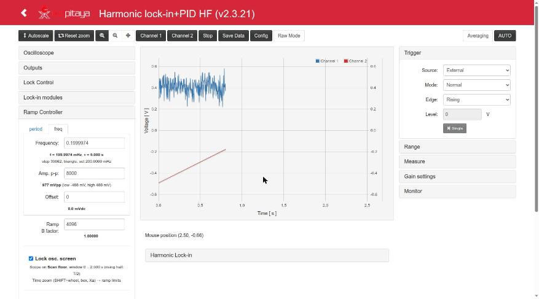

**Turning it off** (`rampLockScreenOff()`, l. 4029):

- unchecking it: the trigger (External / Normal / Scan floor) and the time window **stay as they are**; only the
  normal time zoom of the plot comes back (SHIFT + wheel zooms the view again, without touching the ramp);
- choosing another *Source*, *Ext Trig* or *Mode* in the page (also *Mode* = Single), pressing **AUTO**
  (`serverAutoScale()`, l. 6863), or pressing **Single** (`singleUpdate()`, l. 6358) also turns it off, with the same
  rule (trigger and window kept, the choice of the user applied);
- it is **not saved** in the configs (it is a state of the page: after a reload it is off).

**With Capture Lock** ([Lock Control](#lock-control)): during a capture *Lock osc. screen* is suspended (the
capture uses its own trigger and window; the wheel zoom is only in the page, as for any capture) and when the
capture ends it comes back with its window; ending the capture with **Single** turns it off (above).

Before v2.3.21 the panel had no tabs: *Ramp period*, *Ramp hig lim*, *Ramp low lim*, *Ramp B factor* and the four
checkboxes in one column (test config `lock_mode`: ±5000 counts, ±610 mV, period 400, triangle → 64.16 ms).

### PIDs modules

- **Error signal selector**: *Error signal* (0, Xo, Yo, F1o, F2o, F3o, in1, in1−in2) and its *offset*.
- **PID A / PID B**: *input* (error by default), *reset integral*, *freeze out*, *freeze integral*, and
  the gains *kp*, *ki*, *kd* with the effective value written below (kp as a factor, ki and kd as τ and f).
- **More Options** shows the set point *sp*, the scale selectors of kp (/1../4096), ki (8 ns..9 s; option 4 is
  "65 us") and kd (7.5 ns..491.5 µs), and *SAT lim* (saturation of the integral term, ±122 µV..±1 V):

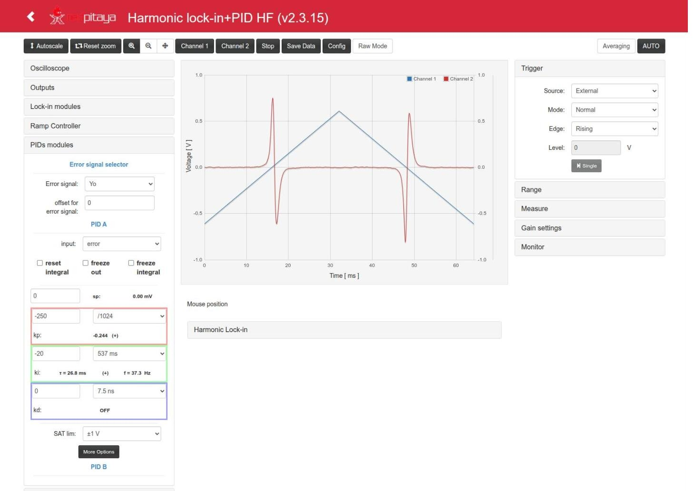

In the example (`lock_mode`) kp = −250 with /1024 gives −0.244, and ki = −20 with 537 ms gives τ = 26.8 ms
(f = 37.3 Hz); kd = 0 (OFF), SAT ±1 V.

### Lock Control

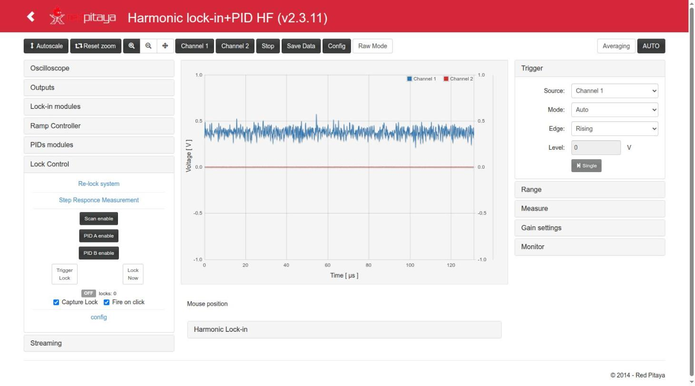

The main part of the panel (from top to bottom):

- **Scan enable / PID A enable / PID B enable**: buttons with the **effective** state of the ramp and the
  PIDs (dark = on). When nothing is locked a click toggles the manual enable; while LOCKED a click
  releases the lock keeping the other enables.
- **Trigger Lock**: arms the lock; it closes when the trigger of the *config* section happens (time,
  level or level+time). **Lock Now**: closes the lock at once. Both stay pressed while requested; a second
  click releases the lock.
- **time / level / time+level** (the three small colored buttons between Trigger Lock and Lock Now; since
  v2.3.18): a shortcut for *Trigger type* + *Choose from graph* + *Fire on click*. Click one (it stays filled while
  it waits, the cursor over the plot is a crosshair and a short note covers the state label and the checkboxes
  below), then click on the plot: the trigger type is set, the time
  and / or level are taken from the click, and *Trigger Lock* fires at once (with *Capture Lock* if checked, even if
  *Fire on click* is unchecked). An active lock is kept until that click, then released and armed again. Esc or a
  second click on the same button cancels.
- **State label**: OFF / ARMED / LOCKED and the number of locks since the FPGA was loaded.
- **Capture Lock** (on by default): every lock request from the page captures the closing of the loop in
  the scope and freezes the trace. **Fire on click** (on by default): with *Choose from graph*, a click on
  the plot sets the trigger value and fires *Trigger Lock*. Design: [`lock_capture.md`](../lock_in+pid_harmonic_hf/doc/lock_capture.md).
- **config** (open it with its title):

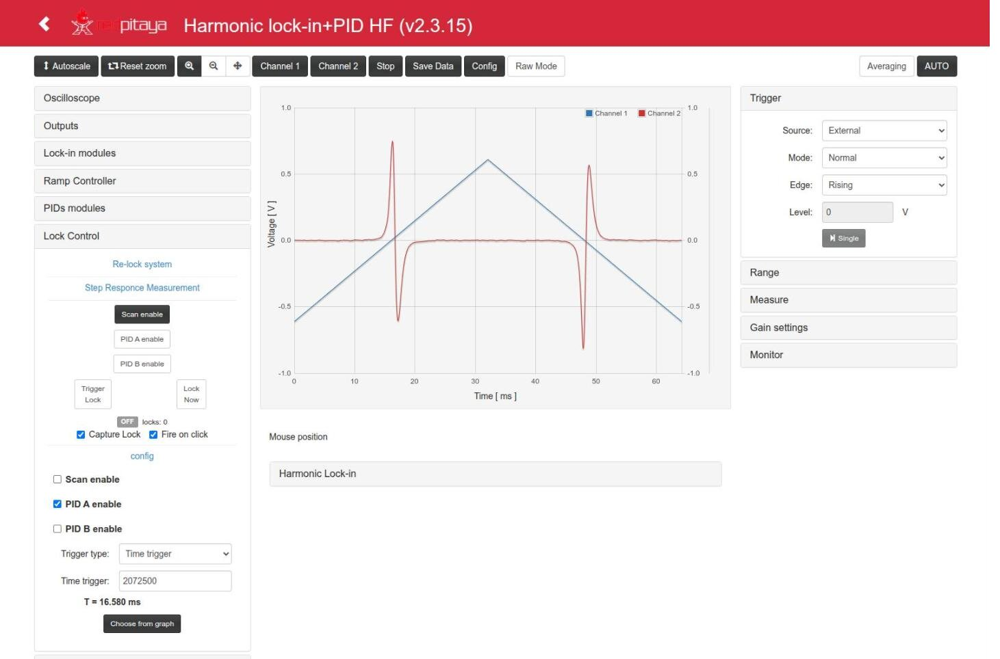

  - *Scan enable*, *PID A enable*, *PID B enable*: what is on **while LOCKED** (usually: scan off, PID A on).
  - *Trigger type*: OFF (only Lock Now), Time trigger, Level Trigger, Level+time Trigger.
  - *Time trigger*: delay after the scan floor, in ticks of 8 ns or with units (`16.58 ms`, `20 s`; see
    [below](#typing-values-with-units)); shown as T below (typing `16.58 ms` gives 2072500, T = 16.580 ms, as in the
    screenshot; the test configuration uses 2072622). 0 = OFF, up to 4294967295 = 34.36 s.
  - *Signal for trigger*, *Level trigger* (counts or `V`/`mV`, shown in mV below), *trig upward?*: for the level
    trigger. In this App the level trigger acts one clock (8 ns) later than in `lock_in+pid_harmonic`
    ([App.md](App.md#lock-control-auto-lock)).
  - **Choose from graph**: the next click on the plot sets the time (or the level, depending on the trigger type)
    of the trigger. A second click on the button (*Cancel*) or Esc cancels it. A red warning appears if the scope
    is not in Normal/Single + External + Scan floor (the only setup where t = 0 of the plot is the scan floor).

- **Re-lock system** and **Step Responce Measurement** (open them with their titles):

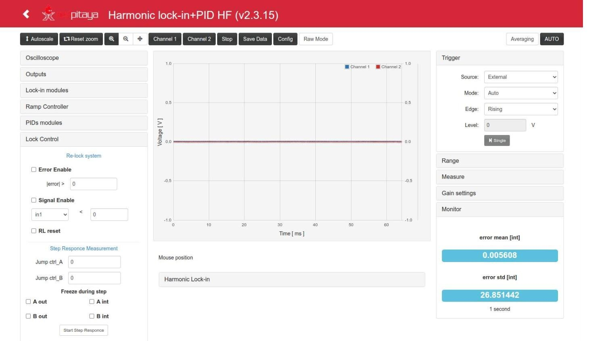

  In the screenshot the loop is closed (LOCKED with the Time trigger, then Trigger Mode Auto): ctrl_A and error are
  flat, and the Monitor shows error mean 0.0056 and std 26.85 counts (≈ 3.3 mV with kp = −250).

  - Re-lock: *Error Enable* with `|error| >` threshold, *Signal Enable* with a signal `<` threshold,
    *RL reset*. Not tested on this version (see [App.md](App.md#re-lock-and-step-response)).
  - Step response: *Jump ctrl_A*, *Jump ctrl_B*, *Freeze during step* (A/B out, A/B int), *Start Step Responce*.

How the lock control works inside: [`lock_control.md`](../lock_in+pid_harmonic_hf/doc/lock_control.md).

### Streaming

See the Outputs screenshot above.

- **IP** (the *IP* button fills in the address of the computer running the browser), **Port** (6000 for
  the server of `resources/streaming`), **Streaming Rate** (1.95 MS/s .. 1.9 kS/s; 0.98 MS/s is the fastest
  continuous rate).
- **Prepare Streaming** starts `c/streaming` on the board; **Start** / **Stop** send the data.
- Start the receiver on the computer first (`resources/streaming/server`, or `nc -l <port>`); details in
  `resources/README.md`. Tested in v2.3.11 at 0.98 MS/s: 26.5 s, no discontinuities ([App.md](App.md#streaming)).

### Right panels and displays

- **Trigger**: *Source* (Channel 1, Channel 2, External), *Mode* (Auto, Normal, Single), *Edge*, *Level* (in V, or in
  ADC counts in Raw Mode, −8192 … 8191, since v2.3.19), and the *Single* button. External uses the *Ext Trig* of the Oscilloscope panel.
  **Auto** (since v2.3.16) waits for the trigger as *Normal* does (the *Level* of the source channel, or the
  *Ext Trig* with Source = External) and forces an acquisition only when no trigger comes within a time limit:
  the largest of 0.25 s, 1.1 × the window + 50 ms and, when the period of the Ext Trig is known (Scan floor /
  Scan ceil with the scan running, harmonic mod.), 1.1 × that period + 50 ms; at most 80 s. So with Ext Trig = Scan
  floor, t = 0 is the scan floor in Auto too (a 30 s scan in a 0…29.4 s window waits up to 33 s and every scan is
  acquired from its floor), and without a trigger (scan stopped or locked with the ramp off, Ext Trig None, a level
  the signal never crosses) the traces keep coming: every 0.25 s plus the acquisition for short windows. As before,
  an Auto acquisition starts at the trigger (no negative times). Up to v2.3.15 Auto triggered at once, at any phase
  of the scan (Scan floor seemed to trigger at the ceiling). The *Level* field and line work in Auto too.
- **Range**: buttons for the X and Y scales and offsets.
- **Measure**: min, max, amplitude, average, frequency and period of each channel.
- **Gain settings**: probe attenuation (1x/10x) and LV/HV jumper setting of each input (scale of the display).
- **Harmonic Lock-in** (below the plot): X, Y, R, φ, F1, F2, F3 in volts.
- **Monitor**: mean and standard deviation of the error over ~1 s, in counts.

### Slow scans

With windows of 1.5 s or more (e.g. a 30 s ramp) the scope reads its memory while the FPGA is still writing it.
Since v2.3.14 (port of `lock_in+pid_harmonic` v2.3.23, see the CHANGELOG):

- **Reset zoom** on a scan of period T ≥ 1.5 s (Ext Trig = Scan floor / Scan ceil / harmonic mod.) sets the window
  to 0 … 0.98 × T (at least 50 ms before the next trigger), so that the scope is armed again in time and every scan
  is acquired. Shorter periods keep one whole period. The rising half of a triangle (second click with Scan floor,
  v2.3.21) is 0 … T/2: it already ends half a period before the next floor, so no 0.98.
- **Lock osc. screen** (v2.3.21) uses 0 … T/2 with a triangle and the same window as Reset zoom (0 … 0.98 × T) with a
  sawtooth, and keeps it when the ramp changes; its time zoom works on an incomplete trace
  ([Lock osc. screen](#lock-osc-screen)).
- The trace is drawn **while it is acquired**, only with valid points of the current acquisition (it starts and
  ends at the valid ones, never mixed with an older lap of the memory, and the previous trace is not left to the
  right). In Normal mode the **whole trace is only seen near the end of each scan**: between the end of the
  window (0.98 × T) and the next scan floor. In Auto mode the same happens for every acquisition: the
  [68.7 s screenshot](#oscilloscope) shows a whole acquisition just before the next one starts.
- **Capture Lock** works with slow scans (Time trigger, Level trigger and Lock Now): the lock request is held until
  the scope has loaded its **history before the lock** (the part of the window before t = 0; banner "loading the
  scope history before the lock (x s)"), then the lock is applied and the capture is drawn as it is acquired.
  Lock Now on a slow window therefore locks after that history, on purpose.
- (FPGA) A time trigger armed after the ramp was stopped (e.g. right after releasing a lock) waits for the next
  scan floor instead of firing in the middle of the scan.

## Typing values with units

The **Time trigger** and **Level trigger** fields of *Lock Control → config* are text fields that accept a number
with a unit (`index.html` l. 2547-2578: `parseTrigTime()` l. 2561, `parseTrigLevel()` l. 2568, `input_unit_parsers`
l. 2575):

| Field | Without unit | Units | Range | Examples |
|---|---|---|---|---|
| Time trigger | ticks of 8 ns | `s` (`seg`), `ms`, `us` (`µs`), `ns`, `tick(s)` | 0 .. 4294967295 (34.36 s); larger values are clamped; a nonzero time below one tick is 1 tick | `16.58 ms` → 2072500, `20 s` → 2500000000, `40 s` → 4294967295 |
| Level trigger | counts | `V`, `mV`, `count(s)` | −8192 .. 8191 (clamped) | `0.1 V` → 819, `120 mV` → 983 |

- Decimal point or comma; the space between number and unit is optional; units are not case sensitive.
- The value is sent when the edit ends (Enter or leaving the field); then the field is rewritten in ticks /
  counts and T / V_trg below it are updated. Escape restores the previous value.
- An empty or invalid text (`abc`, `-5 ms`) is not sent: a red hint appears below the field and the last value
  comes back. The mouse wheel changes the value by one tick / count.
- Values above $2^{24}$ ticks (134 ms) go through the float parameters of the C controller and are rounded to a
  multiple of 2 to 256 ticks; see [FPGA.md](FPGA.md#lock-control-auto-lock).

Tested on the board with this App (v2.3.11, testAgent 2026-10-10 19:35): `16.58 ms` → 2072500, `20 s` →
2500000000, `40 s` → 4294967295 (T = 34.360 s), `2072622`, empty and `abc` + Enter → nothing sent; `0.1 V` → 819,
`120 mV` → 983, `5085`.

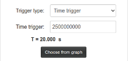

Since v2.3.21 **Ramp period** (tab *period* of the Ramp Controller) is also a text field with units: steps, or the
whole period of the ramp in `s`, `seg`, `ms`, `us` (`rampStepParseField()`, l. 3765, in `input_unit_parsers`), sent
with Enter or when leaving the field and rewritten in steps ([Tabs period and freq](#tabs-period-and-freq)). The fields
of the *freq* tab accept units too (*Frequency* in Hz / kHz / mHz…, *Amp. p-p* and *Offset* in counts or `mV` / `V`).

Other fields still have older unit conversions in the JavaScript, but they are `<input type="number">` fields: the
browser does not give a text with letters to the page (`.val()` is empty), so those conversions can not be reached from
the UI (the same was found for *Ramp period* in `lock_in+pid_plus` 2.2.0-rc2, CHANGELOG v2.3.21):

| Field | Conversion in the code | Usable from the page |
|---|---|---|
| Ramp hig / low lim | `V`, `mV` → counts (`lock_ramp_step_update()`, l. 2134-2150) | no (use *Amp. p-p* / *Offset* of the *freq* tab) |
| PID A / B sp | `V`, `mV` → counts (l. 2263-2266, 2370-2373) | no (not tested on the board) |
| Period of the harmonic oscillator | `s`, `seg`, `ms`, `us` → `gen_mod_hp` with the HF period, `Period = round(T / (120 · 8 ns)) − 1` (`lock_modulation_update()`, l. 2472-2480) | no |
| Phase of the harmonic oscillator | `deg` / `g` / `°`, `rad`, `pi` → counts, 120 points per turn (l. 2460-2469) | no |

## HF notes

Practical points that are specific to this App:

- **Configs of `lock_in+pid_harmonic` give another frequency here.** They have the same keys, and their
  `lock_gen_mod_hp` is kept as is: the test configs of `_h` have hp = 0, which is **49.6 kHz in `_h` and
  1.04 MHz in HF**. For the same 49.6 kHz use hp = 20. Their `lock_gen_mod_phase` (0..2519) is clipped to 119.
  For the test bench use `test_files/lock_in+pid_harmonic_hf__lock_mode.json` (hp 20).
- Configs saved in the browser by `_h` (key `lockConfig_lock_in+pid_harmonic`) or by old versions (shared key
  `lockConfig`) **do not appear in the list** of this App: the old key is not migrated on purpose (the configs
  of both Apps can not be told apart). Use *Save as file* in the other App and *Load file* here.
- **Higher frequency, less signal.** If the system under test (or its electronics) filters the modulation, its
  effect on the response goes down with the frequency. In the test bench (input filter of ~19.9 kHz in
  `dummy_simulator`) going from 49.6 kHz to 104 kHz made the derivative signal ×0.58 smaller; doubling the
  modulation amplitude (`mod_out1` 100 → 200) brought it back, and then **kp had to be halved** (−500 → −250)
  because the loop gain had grown and the loop oscillated at ~4.85 kHz ([procedure 5](#5-locking-at-a-higher-frequency-example-104-khz)).
- The phase between the error signal and the references changes with the frequency (delays of the system and of
  the board). Check X and Y (or F1 with *Phase*) after every change of *Period*; `gen_mod_phase` only rotates
  `cos_1f..3f` (F1..F3), not X/Y.
- Near 1 MHz the 2f and 3f components (2.08 and 3.13 MHz) are close to the bandwidth of the analog front end of
  the board (**a confirmar**), and only a few points per period are generated (120 at 1f, 40 at 3f).
- A lock at 1.04 MHz has **not been tested** with the bench (`dummy_simulator` does not respond at that frequency).

## Procedures

These procedures follow `test_files/lock_test.md`, the procedure used to test every version on the board.
The example numbers are those of the test configuration `test_files/lock_in+pid_harmonic_hf__lock_mode.json`
(49.6 kHz): a system with a resonance (a peak) whose control input is OUT1 and whose response is measured on IN1.

### 1. Scan and see the response of the system

1. **Outputs**: Out1 = `ctrl_A`.
2. **Ramp Controller**: limits ±5000 (±610 mV), period 400 (triangle: 64.16 ms), *Scan enable* checked.
3. **Lock Control**: *Scan enable* button on, *PID A enable* off.
4. **Oscilloscope**: OscA = `Ramp A` (or `ctrl_A`), OscB = `in1`; Ext Trig = *Scan floor*.
5. **Trigger**: Source *External*, Mode *Normal* (picking an Ext Trig already sets them, v2.3.15). Press
   **Reset zoom**: the window goes from 0 to one period of the ramp (0 … 64.16 ms) and t = 0 is the scan floor.
   The preset `in1|ctrl` sets the same pair in one click (with in1 on Channel 1 and ctrl_A on Channel 2).

The response of the system (the peak) appears on Channel 2 at the same position in every sweep.

Alternatives since v2.3.21: in step 2 use the **freq** tab (e.g. Frequency `15.59 Hz`, Amp. p-p 10000, Offset 0), or
type `64.16 ms` in *Ramp period* (gives step 400); and instead of step 5 check **Lock osc. screen**, which sets the
trigger and the window of the rising half of the triangle (0 … 32.08 ms: each peak of the response appears once) in
one click. Then a **box selection** (or SHIFT + wheel) around the peak narrows the scan to that zone at the same
frequency: the peak gets wider on the screen, which is a quick way to find the limits of a scan for the lock
([Lock osc. screen](#lock-osc-screen)). Without Lock osc. screen, a second click of *Reset zoom* also shows the rising
half ([Reset zoom](#reset-zoom-whole-period--rising-half)).

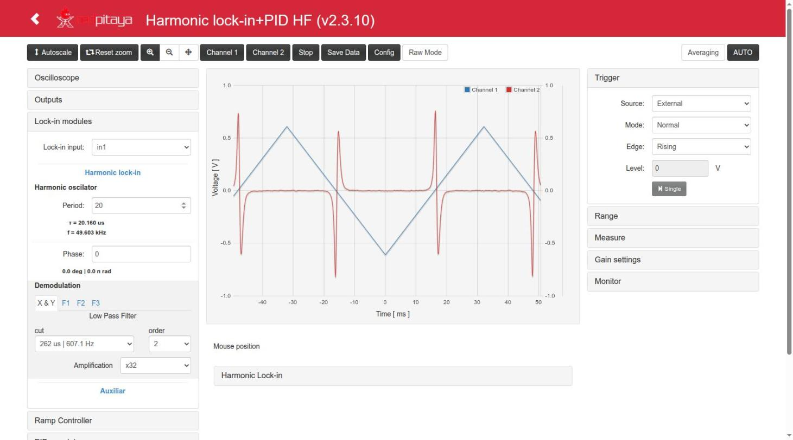

### 2. Configure the lock-in to get an error signal

The lock-in, with a small modulation added to the control signal, gives a signal proportional to the
derivative of the response with respect to the scan: it crosses zero at the maximum of the peak, which is
the error signal for the PID.

1. **Lock-in modules**: Lock-in input = `in1`; **Period = 20 (49.6 kHz)**; *A Out1* = 100 (modulation of ≈ 6 mV
   added to OUT1); X & Y filter 262 µs | 607 Hz, order 2; Amplification ×32.
2. Look at `Xo` and `Yo` (OscA/OscB) during the scan and choose the component (X or Y) that gives a clean
   dispersive curve with a zero crossing at the peak (in the test: Y, lobes +0.75 / −0.61 V; X smaller).
3. **PIDs modules**: Error signal = that component (`Yo` in the test configuration), offset 0.
4. OscA = `ctrl_A`, OscB = `error` (preset `ctrl|err`):

### 3. Close the lock

1. **PID A**: input = error, kp = −250 (/1024, −0.244), ki = −20 (537 ms, τ = 26.8 ms), as in the test
   configuration since 2026-10-12. The sign of the gains has to give negative feedback around the zero crossing
   (try the other sign if the lock runs away). The screenshots of this procedure (v2.3.11) were taken with the
   kp = −500 used before, which gives a noisier lock (error std ~8 mV instead of ~3.3 mV).
2. **Lock Control → config**: while locked, *PID A enable* on and *Scan enable* off.
3. Choose the trigger:
   - **Time trigger**: press *Choose from graph* and click on the zero crossing of the error (≈ 16.6 ms in
     the example; 16.58 ms = 2072500 ticks). With *Fire on click* on, the click also fires *Trigger Lock*.
   - Shortcut: press the small **time** (or **level**, **time+level**) button between *Trigger Lock* and
     *Lock Now* and click on the plot: type, value and *Trigger Lock* in one go (steps 3 and 4).
   - **Level trigger**: Signal for trigger = error, Level = the value of the error just before the
     crossing (5085 counts = 621 mV in the test), *trig upward?* according to the slope.
   - **Lock Now**: locks immediately wherever the ramp is (useful only when the system is already near the
     point).
4. Press **Trigger Lock**. The state goes OFF → ARMED → LOCKED in the next sweep; with *Capture Lock* the
   scope shows the closing of the loop (t = 0 is the lock) and keeps it frozen:

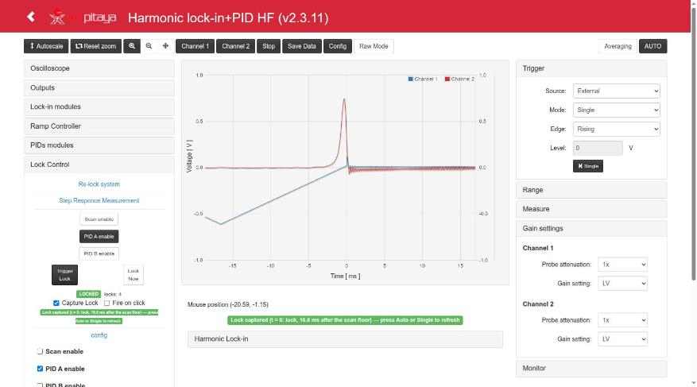

With the level trigger (here with Capture Lock off, last sweep in Normal mode):

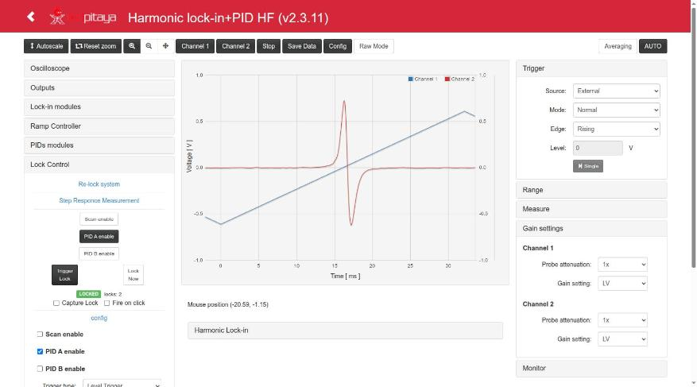

Fire on click on a frozen capture moves the lock point and locks again:

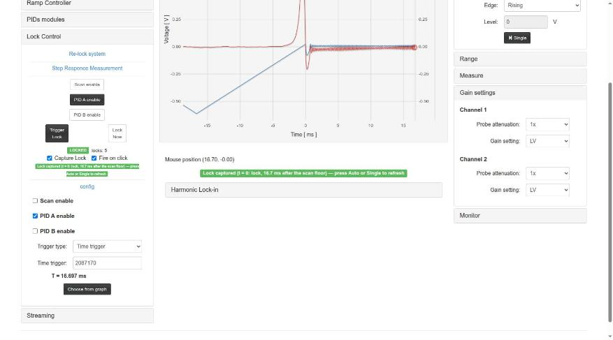

With a long time trigger the state stays ARMED until the time is reached (here 40 s, clamped to 34.36 s):

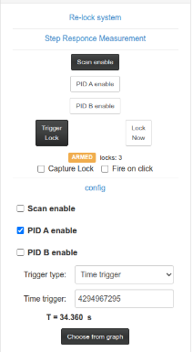

The whole sequence (Choose from graph → Trigger Lock → Auto → release → Level → Lock Now → ARMED → units →
Capture Lock → AUTO → Fire on click) in a GIF: [lock_sequence_49k6.gif](.Usage/lock_sequence_49k6.gif).

If *Choose from graph* shows the red warning, t = 0 of the plot is not the scan floor and the time taken
from the click would be wrong:

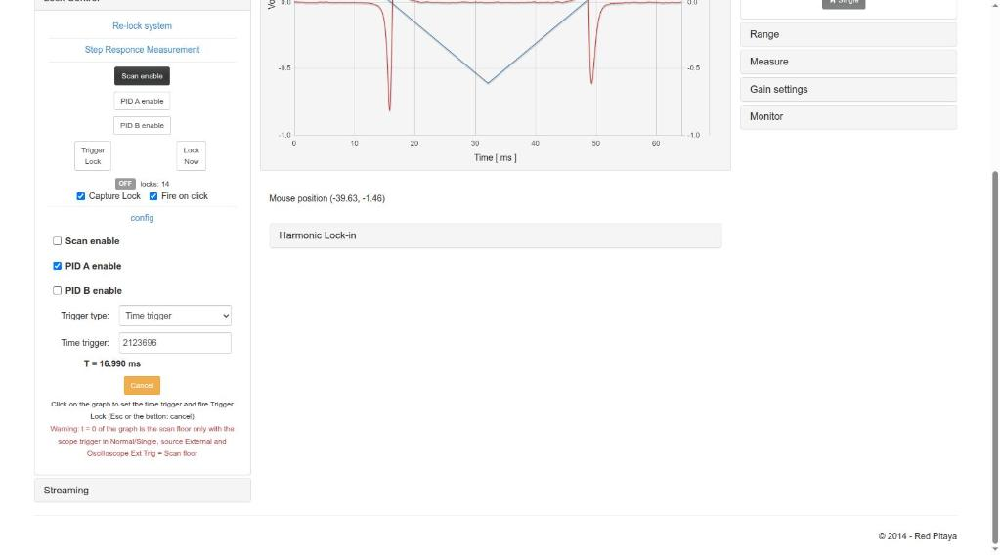

The frozen capture ends (and the scope settings saved before the capture are restored) with trigger mode
Auto/Normal, *Single*, **AUTO**, a change of source or Ext Trig, unchecking *Capture Lock*, or a release
while waiting. *Autoscale* keeps it.

### 4. Check the lock and release it

1. Set the trigger Mode to **Auto**: the ramp has stopped and the error stays at 0 (OscA = `ctrl_A`,
   OscB = `error`):

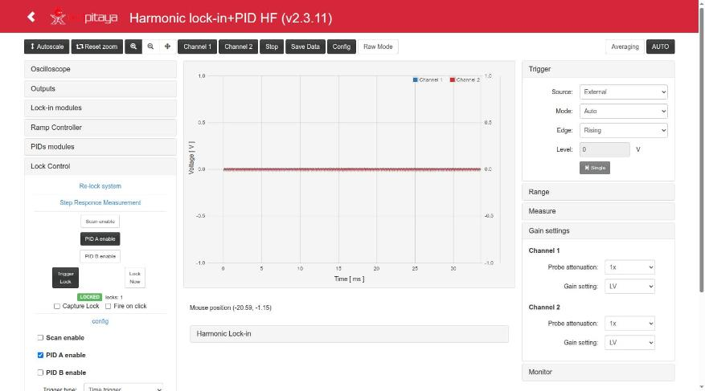

2. With OscA = `in1` the signal stays at the top of the peak (IN1 ≈ 0.44 V = the peak in the test):

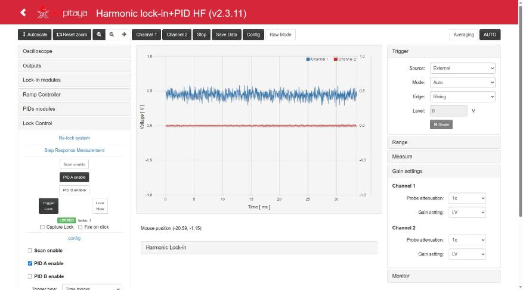

3. The **Monitor** panel shows the mean (≈ 0) and the std of the error: ≈ 27 counts ≈ 3.3 mV with kp = −250
   (26.85 counts in the [screenshot](#lock-control) of the Monitor, v2.3.15). With the kp = −500 of the configuration
   before 2026-10-12 it was ≈ 62 counts ≈ 7.5 mV.
4. **Release**: a second click on *Trigger Lock* (or *Lock Now*), or a click on *Scan enable* (restarts the
   scan with the PIDs as they were).

A lock can also be closed and checked without the web page, with `py/lock_from_registers.py` on the board
or over HTTP (see [Remote.md](Remote.md)); the page follows the state without sending anything.

### 5. Locking at a higher frequency (example: 104 kHz)

Done on the board with v2.3.11 against the same simulated peak (`reportes/lock-in_pid_h_hf_lock_test/2026-10-10_19:39:00_lock.md` §3):

1. Start from the 49.6 kHz lock above and set **Period = 9** (104.17 kHz).
2. Look at X and Y during the scan (OscA = `Xo`, OscB = `Yo`). With *A Out1* = 100 the Y signal was ×0.58
   smaller (+0.44 / −0.32 V), X almost 0:

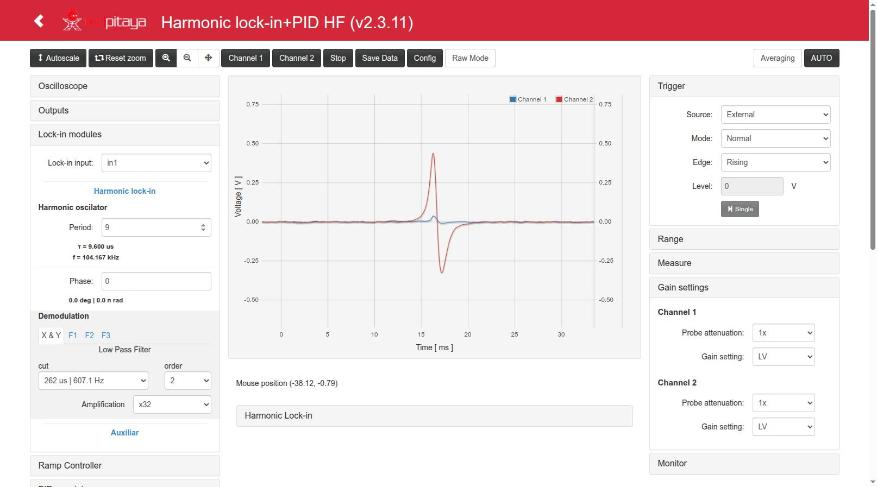

3. **A Out1 = 200**: Y back to +0.88 / −0.64 V, zero crossing still in Y, so the error selector and the sign of
   kp/ki stay the same.
4. Lock with kp = −500: it locks but oscillates at ~4.85 kHz (error std 16 mV) — too much gain:

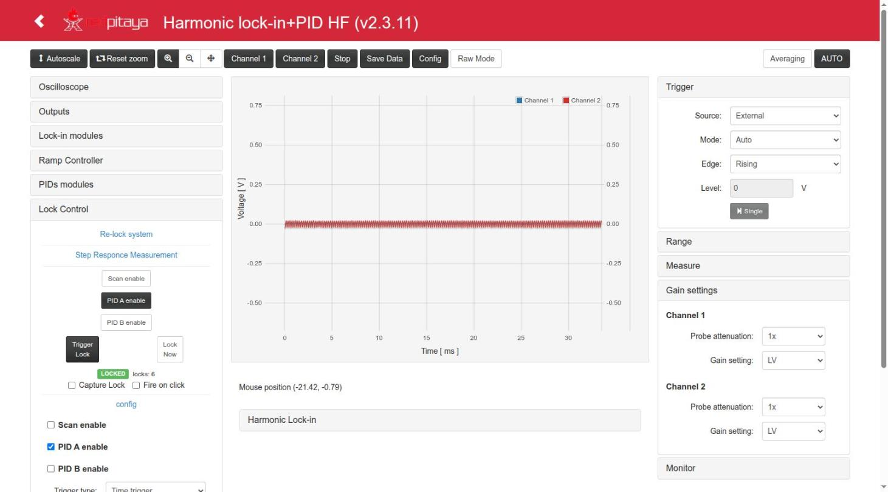

5. **kp = −250**: stable lock, error std 1.3-1.5 mV, IN1 = 1.03 × the peak:

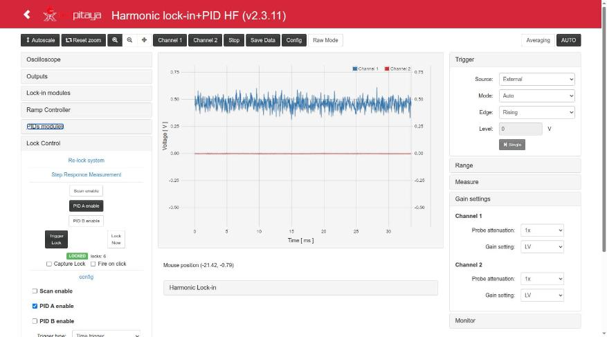

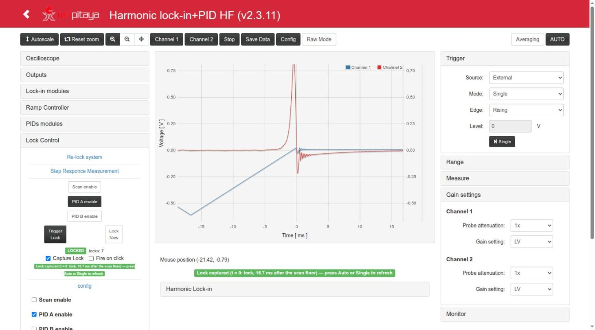

The result is saved as `test_files/lock_in+pid_harmonic_hf__lock_mode_100k.json` (hp 9, `mod_out1` 200,
kp −250). In general: after moving the modulation frequency, re-check the size and the phase of the error signal
and retune the gains.

## Saving and loading configurations

**Config** opens the configuration dialog:

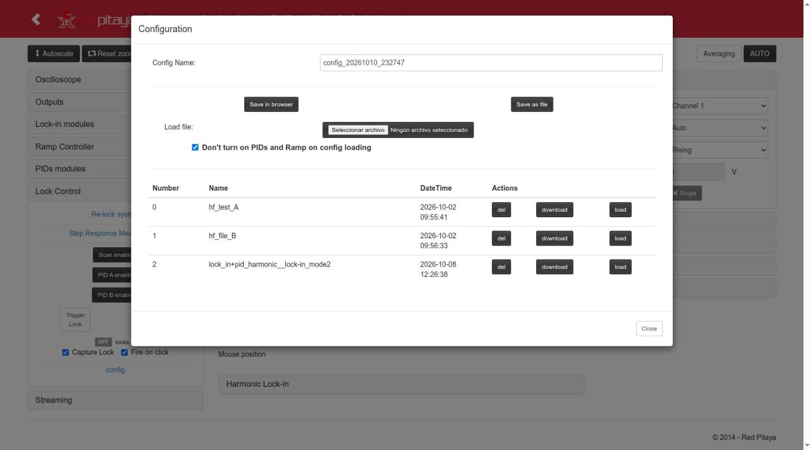

- *Save in browser* stores all the parameters (and the Capture Lock / Fire on click preferences) under the
  *Config Name* in the browser (`localStorage`, key `lockConfig_lock_in+pid_harmonic_hf`). *Save as file*
  downloads a JSON.
- The list shows the saved configs with *del*, *download* and *load*. *Load file* adds a JSON file to the list
  (then press its *load*).
- **Don't turn on PIDs and Ramp on config loading**: **unchecked by default** (since v2.3.16; up to 2.3.15 it was
  checked). Unchecked, *load* (also of a *Load file*) sets the ramp (*Scan enable* and the Lock Control ramp
  enable) and the PIDs as they are in the config: a config saved while scanning loads scanning. Checked, a loaded
  config never turns them on (useful when the outputs are connected to an experiment). The same option applies to
  the restore of the last config / tab state after a start / *Restart*. A lock request (*Lock Now*, *Trigger Lock*) is never
  loaded. The option is not saved: every page load starts with it unchecked.
- Configs are per browser, not stored on the board. Configs of `lock_in+pid_harmonic` must be loaded as files,
  and their *Period* has another meaning here ([HF notes](#hf-notes)).
- **Load last config on init** (since v2.3.17): **checked by default**; the choice is kept in the browser
  (`localStorage`, key of this App). The page saves the current settings automatically every ~2 s (the *last
  config*, also in `localStorage`). Checked, each time the page starts the App (main menu, new tab, F5) it restores
  the last config; unchecked, the App starts with its defaults. The ramp / PIDs of the restored config follow the
  option above; a lock request is never restored.
- **Load last config** / **Reset to defaults** (since v2.3.17): close the dialog and restart the App (the page reloads,
  the FPGA is reloaded: outputs and lock are reset) with the last config / with the default parameters of the App (as
  a fresh start: lock open, ramp stopped, PID gains 0), whatever the checkbox says. After *Reset to defaults* (or an
  open with the box unchecked) the last config is kept until a parameter is changed, so *Load last config* brings it
  back.
- **Time window**: *load* applies the time window of the config in the units it was saved with (the page
  converts it and then takes the window and units of the answer of the last of the 5-9 POSTs). Tested with this
  App (v2.3.11): 6/6 loads of a config in ms from windows of 0-130 µs, 500/100/20 µs and 2 s → −2.07…33.49 ms.
  Up to v2.3.10 the window could be left in µs with the numbers of ms.
- The load does not send the scale values derived by the server (`forcex_flag`, `time_units`, `time_range`,
  `gui_xmin`, `gui_xmax`), and since v2.3.12 neither the read-only display values (`meas_*`, `lock_X`, `lock_Y`,
  `lock_lock_status`, `lock_lock_control`, …; up to v2.3.11 they were sent and ignored by the controller).
- A load ends a frozen lock capture (the config brings its own scope settings).
- *Lock osc. screen* and the active tab of the Ramp Controller are not saved in the configs (v2.3.21). A load changes
  the ramp, so with *Lock osc. screen* on the window follows it.

## Saving data

*Save Data* gives the data of the plot as Python/Numpy vectors, Matlab/Octave vectors or CSV (save as a
file, copy or show).

## Several clients and Restart

Only one browser tab should control the board. When another client (another tab, the main menu, another
App) takes the board, the page stops polling and shows a dialog:

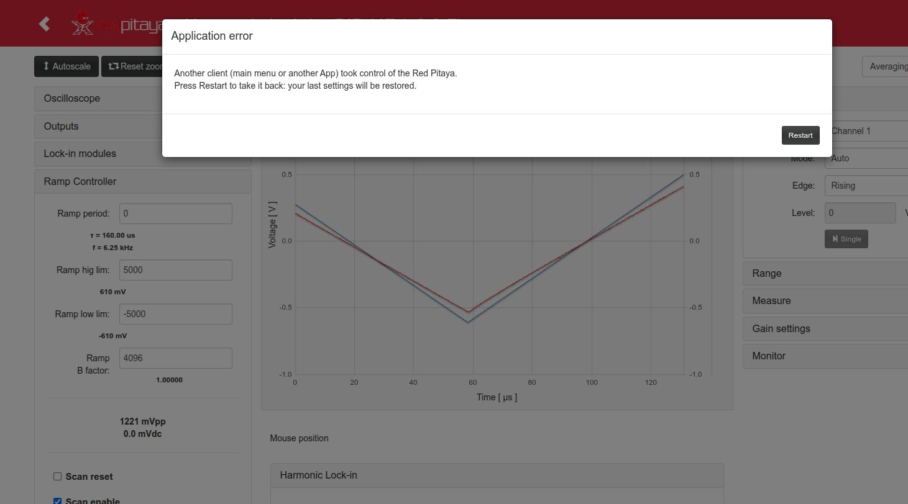

*Restart* restarts the App and restores the state of this tab (with *Load last config on init* checked or not) (if the other client loaded the same App,
the FPGA is not reloaded). On Ecosystem 2.0 the page also enters a "cautious mode" when the board answers
slowly, and waits until it answers fast again.

## Known limitations of the interface

- The **Slow outputs** selectors have no effect; the **R|Phase Mode** button is disabled.
- *Time trigger* values above $2^{24}$ ticks (134 ms) set from the page are rounded to the float32 grid (≤ 1 µs).
- *Ramp hig lim* / *Ramp low lim* (tab *period*) do not accept `mV` / `V`: they are `<input type="number">` fields
  ([Typing values with units](#typing-values-with-units)); use *Amp. p-p* / *Offset* of the *freq* tab.
- The mouse wheel over *Ramp period* does not move the step above $2^{24}$ (16777216 steps; with N = 16000 a period of
  ≈ 2147 s): the parameter travels as a float32, and ±1 rounds back to the same value (granularity 2 … 128 there). At
  the maximum 2147483520, wheel −1 sends 2147483519 and 2147483520 comes back (seen on `lock_in+pid_plus` 2.2.0-rc2,
  same code). Typing a value or a period works. (The wheel of the *freq* tab already moves to the next float32 step.)
- After a **reload of the page with a slow scan running** (windows ≥ 1.5 s, continuous update), the X axis follows the
  trace while it grows instead of staying on the window; *Reset zoom* fixes it (seen on `lock_in+pid_plus`
  2.2.0-rc2; probably older than the Ramp Controller; not checked with this App).
- `loadParams()` keeps the window of the plot in the parameters only when its minimum is not 0
  (`if(options.xaxes[0].min && options.xaxes[0].max)`, `index.html` l. 5529): with a window that starts at t = 0 the
  parameters take the `xmin` / `xmax` of the server instead of those of the plot. Up to v2.3.20 this let a repeated
  *Force X* undo a wheel / box zoom made from t = 0 before its POST; since v2.3.21 the *Force X* is filtered
  ([Structure.md](Structure.md#time-window-of-the-plot-and-force-x)), but the rule of `loadParams()` is unchanged
  (pending for devAgent).
- *Phase* typed with units is clipped to 120 (the register maximum is 119; the C controller corrects it), and
  *Period* typed with units is clipped to 819100 (the register maximum is 16383) (`index.html` l. 2467, 2479); both
  conversions are unreachable from the page anyway (number fields, above).
- The options 6-8 of *Signal for trigger* are 0 (labelled "0 (sqXo)" … since v2.3.12; they showed code text before).
- Each change made in the page is a `POST /data`, and on Ecosystem 2.0 each one leaves an open connection in the
  nginx of the board; after ~1000 the board stops answering until nginx is restarted
  ([Remote.md](Remote.md#known-issue-of-the-ecosystem-post-data-leaves-connections-open)).
- Level+time with the time after the level crossing stays ARMED (the level crossing has to happen after
  the time).

These items are listed for devAgent in `docAgent.md`.
